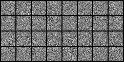
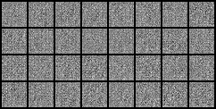
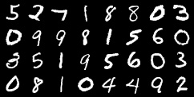

# Handwritten Digit Generator

Train a handwritten digit generator on the [MNIST dataset](http://yann.lecun.com/exdb/mnist) using Pytorch.


## Installation and Usage

Clone the repo in the destination folder of your choice:
```bash
git clone https://github.com/vincenzofanizza/digit_generator.git
```
then, create and activate a new virtual environment by running:

```bash
conda create -n digit_generator python=3.9.16
conda activate digit_generator
```
This project requires the following dependencies:
- Pytorch
- NumPy
- OpenCV
- Tensorboard

You can install them with:
```bash
pip install -r requirements.txt
```
Finally, start training a digit generator with the following:
```bash
python train.py --cfg=configs/<CONFIG_FILE> --out_dir=<OUT_DIR>
```

where ```<CONFIG_FILE>``` is a json file containing the required hyperparameters and ```<OUT_DIR>``` is the directory where all the generated outputs will be saved. You can take one of the examples in the [configs](./configs) folder as a template to train your own digit generator.


## Basic Overview

Generative Adversarial Networks (GANs) are a type of machine learning model consisting of a generator and a discriminator network. GANs are designed to generate data samples replicating those of the given training dataset. GANs are based on the idea that the generator should learn the data distribution of the training set and then produce synthetic samples, whereas the discriminator is trained to classify data as real (i.e, directly sampled from the training set) or fake (i.e, reproduced by the discriminator).

The generator and discriminator are trained simultaneously in a competitive manner. GAN training relies on the same good practices and follows most of the steps as traditional network training. Both models are initialized with random weights and trained over a dataset split into batches. However, while traditional network training only consists of optimizing the parameters of a single network, a complete GAN training steps includes the following steps:
1. **Generator Training:** The generator takes random noise as input and generates synthetic samples. These samples are fed into the discriminator.
2. **Discriminator Training:** The discriminator receives both real data samples and synthetic samples to classify. The discriminator is trained using backpropagation to update its weights and improve its discrimination ability.
3. **Adversarial Training:** The generator's goal is to fool the discriminator by generating samples that are classified as real. The generator's weights are updated using gradients obtained from the discriminator's feedback.
   
Given its competitive nature, adversarial training tends to be more sensitive to hyperparameters and less stable than traditional training. For this reason, it is important to test different hyperparameters before running the final training run. In this project, the considered architectures were trained using a range of learning rates (between 1e-4 and 5e-3), selecting the one producing the best results as the final value. 


### Architectures

Two architectures were implemented: a Fully-Connected Neural Network (FCNN) and a Convolutional Neural Network (CNN). Both were trained and tested using MNIST images normalized by the dataset mean and standard deviation.

- **FCNN:** Concerning the Fully-Connected (FC) architecture, the generator takes a random noise vector of size ```z_dim``` as input and generates a 28x28 output image. The generator has a single hidden layer with 256 neurons. To match the distribution of real MNIST images, the output is mapped to the range [-1, 1] using the tanh activation function. Both FC layers use the LeakyReLU activation function. The discriminator takes 28x28 images as input and processes them through a hidden layer with 128 neurons. It outputs a scalar value between 0 and 1, where values closer to 1 indicate higher confidence that the processed image is real. The output is mapped to the range [0, 1] using the sigmoid activation function. The FC layers in the discriminator also use the LeakyReLU activation function. It's worth noting that the FC network operates on 1D vectors, so the MNIST images are encoded as 1D vectors with 784 entries.


- **CNN:** The CNN generator takes a 2D random noise vector of size ```z_dim```x```z_dim``` as input. It includes one linear layer, two transposed-convolution layers, and a final 2D convolution layer. The ReLU activation function is used for the linear and transposed-convolution layers. The discriminator comprises two convolutional layers and two FC layers. It uses the sigmoid activation function to map the output to the range [0, 1]. The convolutional layers employ max-pooling and ReLU activation. Dropout is applied to increase the network's robustness during training. In this case, the images and random noise can be fed to the discriminator and generator as 2D vectors.

The table provided below summarizes the number of parameters for each network. It is evident that the CNN discriminator has 80% fewer parameters than its FC counterpart, resulting in a lower parameter count for the CNN architecture as a whole. For a more detailed overview of the implementation, have a look at [their implementation](./core/nets).

<div align="center">

| Architecture: |   FCNN  |   CNN   |
|:-------------:|:-------:|:-------:|
| Discriminator | 100,609 |  21,381 |
|   Generator   | 218,128 | 245,633 |
|     Total     | 318,737 | 267,014 |

</div>


### Training Settings

The two architectures were trained using the following hyperparameters:
- **Optimizer:** Adam;
- **Learning rate:** 5e-4;
- **Batch size:** 32;
- **Epochs:** 50;
- **Input noise size:** 64.

The final trained models are stored in the [models](./models) folder.


## Results and Conclusions

The evolution of the images generated for a fixed batch of input noise is shown below, together with a grid of real images. Despite the lower number of parameters, the experiment showed how CNN-based architectures tend to be a better solution for GANs, generating visually-better results. The FCNN GAN, on the other hand, struggles in generating plausible images. The feature it seems to struggle the most with compared to the CNN GAN is the image background. While the CNN architecture quickly learns how MNIST data are characterized by a dark and homogeneous background, the FCNN architecture keeps generating highly-noisy images. Finally, it can also be seen how the digit shape in the CNN case resembles that of the actual MNIST images more than in the FCNN case.

- **FCNN:**  
<p align="center">
  
</p>

- **CNN:**
<p align="center">
  
</p>

- **Real images:**
<p align="center">
  
</p>
